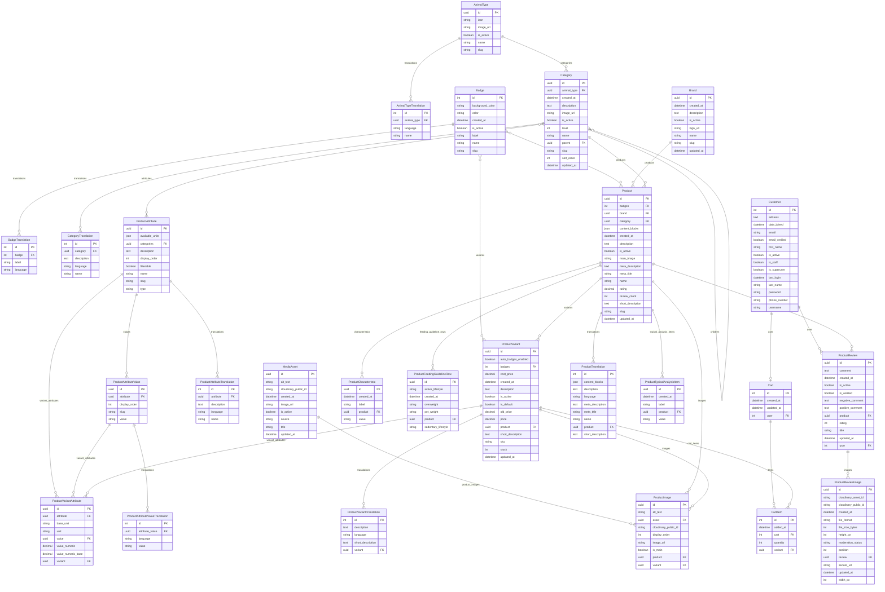

# Database Diagram

<!-- WARNING: This file is auto-generated by `python manage.py generate_diagram`. -->
<!-- Do not edit this file manually. Regenerate it from Django models instead. -->

```mermaid
erDiagram
    AnimalType {
        uuid id PK
        string icon
        string image_url
        boolean is_active
        string name
        string slug
    }
    AnimalTypeTranslation {
        int id PK
        uuid animal_type FK
        string language
        string name
    }
    Badge {
        int id PK
        string background_color
        string color
        datetime created_at
        boolean is_active
        string label
        string name
        string slug
    }
    BadgeTranslation {
        int id PK
        int badge FK
        string label
        string language
    }
    Brand {
        uuid id PK
        datetime created_at
        text description
        boolean is_active
        string logo_url
        string name
        string slug
        datetime updated_at
    }
    Cart {
        int id PK
        datetime created_at
        datetime updated_at
        int user FK
    }
    CartItem {
        int id PK
        datetime added_at
        int cart FK
        int quantity
        uuid variant FK
    }
    Category {
        uuid id PK
        uuid animal_type FK
        datetime created_at
        text description
        string image_url
        boolean is_active
        int level
        string name
        uuid parent FK
        string slug
        int sort_order
        datetime updated_at
    }
    CategoryTranslation {
        int id PK
        uuid category FK
        text description
        string language
        string name
    }
    Customer {
        int id PK
        text address
        datetime date_joined
        string email
        boolean email_verified
        string first_name
        boolean is_active
        boolean is_staff
        boolean is_superuser
        datetime last_login
        string last_name
        string password
        string phone_number
        string username
    }
    MediaAsset {
        uuid id PK
        string alt_text
        string cloudinary_public_id
        datetime created_at
        string image_url
        boolean is_active
        string source
        string title
        datetime updated_at
    }
    Product {
        uuid id PK
        int badges FK
        uuid brand FK
        uuid category FK
        json content_blocks
        datetime created_at
        text description
        boolean is_active
        string main_image
        text meta_description
        string meta_title
        string name
        decimal rating
        int review_count
        text short_description
        string slug
        datetime updated_at
    }
    ProductAttribute {
        uuid id PK
        json available_units
        uuid categories FK
        text description
        int display_order
        boolean filterable
        string name
        string slug
        string type
    }
    ProductAttributeTranslation {
        int id PK
        uuid attribute FK
        text description
        string language
        string name
    }
    ProductAttributeValue {
        uuid id PK
        uuid attribute FK
        int display_order
        string slug
        string value
    }
    ProductAttributeValueTranslation {
        int id PK
        uuid attribute_value FK
        string language
        string value
    }
    ProductCharacteristic {
        uuid id PK
        datetime created_at
        string label
        uuid product FK
        string value
    }
    ProductFeedingGuidelineRow {
        uuid id PK
        string active_lifestyle
        datetime created_at
        string overweight
        string pet_weight
        uuid product FK
        string sedentary_lifestyle
    }
    ProductImage {
        uuid id PK
        string alt_text
        uuid asset FK
        string cloudinary_public_id
        int display_order
        string image_url
        boolean is_main
        uuid product FK
        uuid variant FK
    }
    ProductReview {
        uuid id PK
        text comment
        datetime created_at
        boolean is_active
        boolean is_verified
        text negative_comment
        text positive_comment
        uuid product FK
        int rating
        string title
        datetime updated_at
        int user FK
    }
    ProductReviewImage {
        uuid id PK
        string cloudinary_asset_id
        string cloudinary_public_id
        datetime created_at
        string file_format
        int file_size_bytes
        int height_px
        string moderation_status
        int position
        uuid review FK
        string secure_url
        datetime updated_at
        int width_px
    }
    ProductTranslation {
        int id PK
        json content_blocks
        text description
        string language
        text meta_description
        string meta_title
        string name
        uuid product FK
        text short_description
    }
    ProductTypicalAnalysisItem {
        uuid id PK
        datetime created_at
        string label
        uuid product FK
        string value
    }
    ProductVariant {
        uuid id PK
        boolean auto_badges_enabled
        int badges FK
        decimal cost_price
        datetime created_at
        text description
        boolean is_active
        boolean is_default
        decimal old_price
        decimal price
        uuid product FK
        text short_description
        string sku
        int stock
        datetime updated_at
    }
    ProductVariantAttribute {
        uuid id PK
        uuid attribute FK
        string base_unit
        string unit
        uuid value FK
        decimal value_numeric
        decimal value_numeric_base
        uuid variant FK
    }
    ProductVariantTranslation {
        int id PK
        text description
        string language
        text short_description
        uuid variant FK
    }

    AnimalType ||--o{ AnimalTypeTranslation : translations
    AnimalType ||--o{ Category : categories
    Badge ||--o{ BadgeTranslation : translations
    Badge }o--o{ Product : products
    Badge }o--o{ ProductVariant : variants
    Brand ||--o{ Product : products
    Cart ||--o{ CartItem : items
    Category ||--o{ Category : children
    Category ||--o{ CategoryTranslation : translations
    Category ||--o{ Product : products
    Category }o--o{ ProductAttribute : attributes
    Customer ||--o{ ProductReview : user
    Customer ||--o| Cart : user
    MediaAsset ||--o{ ProductImage : product_images
    Product ||--o{ ProductCharacteristic : characteristics
    Product ||--o{ ProductFeedingGuidelineRow : feeding_guideline_rows
    Product ||--o{ ProductImage : images
    Product ||--o{ ProductReview : reviews
    Product ||--o{ ProductTranslation : translations
    Product ||--o{ ProductTypicalAnalysisItem : typical_analysis_items
    Product ||--o{ ProductVariant : variants
    ProductAttribute ||--o{ ProductAttributeTranslation : translations
    ProductAttribute ||--o{ ProductAttributeValue : values
    ProductAttribute ||--o{ ProductVariantAttribute : variant_attributes
    ProductAttributeValue ||--o{ ProductAttributeValueTranslation : translations
    ProductAttributeValue ||--o{ ProductVariantAttribute : variant_attributes
    ProductReview ||--o{ ProductReviewImage : images
    ProductVariant ||--o{ CartItem : cart_items
    ProductVariant ||--o{ ProductImage : images
    ProductVariant ||--o{ ProductVariantAttribute : variant_attributes
    ProductVariant ||--o{ ProductVariantTranslation : translations
```
